<h3>Version Control</h3>
Available in VERSION.md file

<h3>Project Info</h3>

Pixel Studio is a fully functional business site that enables user to browse through our offer regarding, web, design, print, programming and other IT related businesses.
It enables user ability to login and eventually buy some services (just like any popular webstore). It also provides order history for user.

<h3>UX</h3>
Page is divided into 3 subsections 
1: Top Navigation Bar - > contain search bar, my account info and shopping cart. 
1.1 -Pixel Studio with a link to homepage 
1.2 - Services which gives a list of all services (Web development, Graphic Desig, Print, Hosting & Domains) 
1.3 - Web development (Starter, Functional, Blog, E-commerce)
1.4 - Graphic Design (Logo & Logotypes, Business Cards, Posters, Flyers & Leaflets, Signs & Banners, Invitationas, Labels & Stickers)
1.5 - Print 
1.6 - Hosting & Domains  
1.7 - About - short description about the business 
1.8 - Frequently Asking Questions - help about most of the things 
  
2. Footer - at the bottom of the page containing info with address and > 
2.1 - Privacy Policy -standard procedure how do We handling your data 
2.2 - Testimonials - some information about recent jobs 
2.3 - Directions - google map with location of our office 
2.4 - Contact Us - form provided to make it easier contacting with us  
2.5 - Social Media Links - Instagram, LinkedIn, Facebook 

<h3>User Stories</h3>

As a <strong>Customer</strong> I would like to search through available product so I can find what I desire. 
As a <strong>Customer</strong> I would like to see each individual service so I can identify price. 
As a <strong>Customer</strong> I would like to see my shopping cart so I can track my potential expenses 
As a <strong>Customer</strong> I would like to specify a category for desired service so I can find perfect match 
As a <strong>Customer</strong> I would like to have a help link available with answers to the most commons sections 
As a <strong>Customer</strong> I would like to see what I have searched for and the number of results so I can quickly decide if any product suits me  
As a <strong>Customer</strong> I would like to have a order history so I can track my spendings 

 

As a <strong>Site User</strong> I would like to have an option to login in order to have my details saved 
As a <strong>Site User</strong> I would like to have all information presented nicely so I can easily find what I am looking for 

 

As a <strong>Site Owner</strong> I would like to have ability to login so I can see all technical website info 
As a <strong>Site Owner</strong> I would like to have ability to add services into my collection so I can expand my bussiness 
As a <strong>Site Owner</strong> I would like to add more information for FAQ section so the users can find easier what they are looking for 
As a <strong>Site Owner</strong> I would like to see the users order history so I can track it and see for any possible failures 
 

<h3>Testing</h3>

Website was tested using 3 devices: Desktop PC, Tablet (Samsung a300) and smartphone (Samsung s8+ EDGE). 
Website was also tested using Inspect function in Google Chrome.  
HTML and CSS Validator were also used in place. 

<h3>Testing write-up</h3>
 
 <h5>1. SearchBar</h5>
 We gonna type flyers in search bar in order to find if any service like that is available: 
 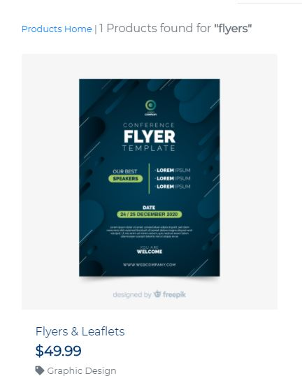 
 <h5>2. Login & register</h5>
To login first user have to be registered. After registration is easy to login by just typing your credentials and clicking sign in button 
 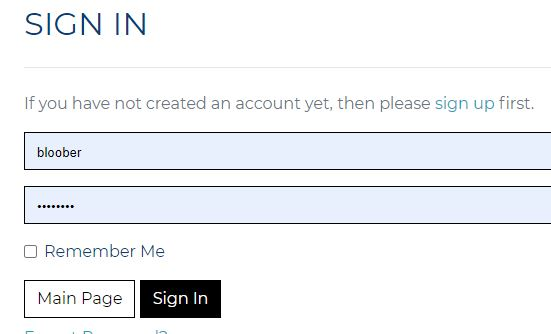 
After loggin user should be prompted with success message 
 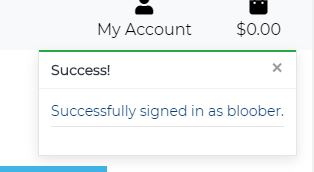 
 <h5>3. Using Contact Form</h5>
 To use contact form make sure all fields are correct(contain information). Otherwise form would not be send and will return error like that: 
  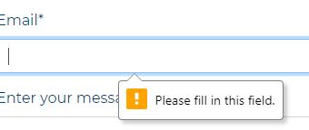 
After success message will be send on e-mail and also printet in terminal 
 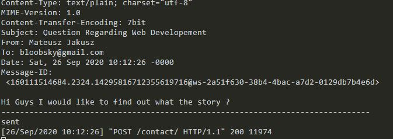 
<h5>4. Using Product Management Form </h5>
You have to be logged in as a SuperUser in order to see te option in My Account 
Form will not be valid if any required field is missing (name, description, price)
 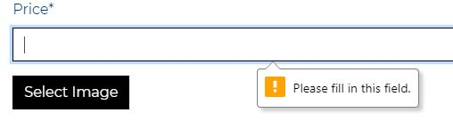 
If form is valid service would be added into a database and admin would get a success message
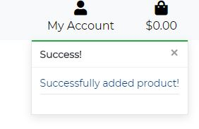 
In Order to delete the product Admin should click small delete button 
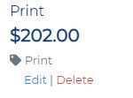 
<strong>Please Be Careful as there is no confirmation for deleting the product</strong>
 
<h5>4. Adding Product to a shopping car</h5> 
In order to add desire product to shopping cart, user shall press Add SERVICE near Product 
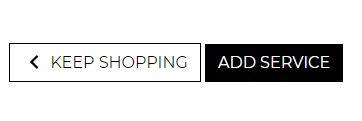 
User would be prompted with success Message in top-right corner 
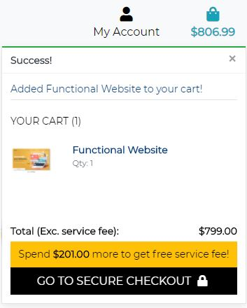 
User can click now Shopping Car to see all the products he added 
 
<h5>5. Checkout</h5> 
In order to checkout a user have to press secure checkout button 
 
Than Using the Form Provided. For purpose of testing user should type 4242 4242 4242 4242 and any future date and any cvc.  
If any information are missing. form cannot be send. 
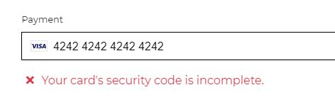  
If everything was correct. User should have a Success Message in top-right corner 
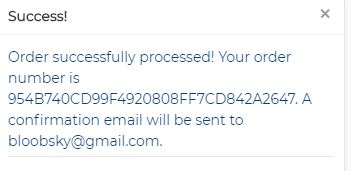  
 and also a confirmation of it 
   
<h5>6. FAQ</h5> 
In order to add some more questions into a FAQ subsection. Admin has to log in into /admin.
After Successfuly Login Admin should look for FAQ section that looks like this: 
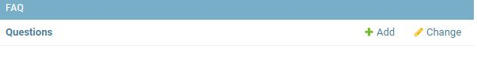  
 In top-right corner admin should see add question button after click a form should appear 
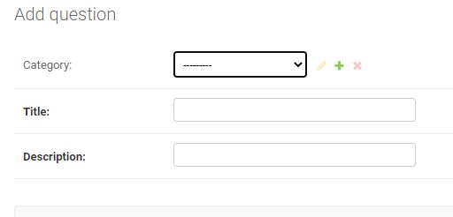  
After filling a form admin should press the "SAVE" button and the job is done.
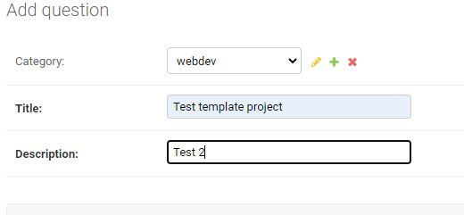  
Final should look like:
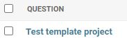  

<h3>Deployement</h3>

Using Git Command Line to upload to a repository
Type in terminal these commands: 
<code>git init</code> to initialize a new repository 
<code>git add README.md</code> to add README.md file to repository 
<code>git commit -m "Initial commit"</code> to add a message for first commitement 
<code>git remote add origin https://github.com/bloobsky/your_repository_name.git</code> to assign repository 
<code>git push -u origin master</code> to upload files to the repository

<h4>For heroku development type in terminal these commands</h4>

<code>heroku login</code> "then entry your login and password" 
<code>pip3 freeze > requirements.txt</code> "these is essential for heroku to work" 
<code>echo web: python app.py > Procfile</code> create a Procfile with "web: python app.py" 
<code>heroku git:clone -a [repository_name]</code> 
<code>git push heroku master</code>
 

<h4>Your website is available now @ https://repository_name.herokuapp.com</h4>

<h3>Project is deployed @ GitHub and Heroku</h3>
Github was used in deployement process as it is integrated, simple and ther is no need to use additional services. It also containt Version Control and everything is uploaded using terminal commands (git) 
How it is done ? 
Open www.github.com.  Login with your credentials On the Navigation Bar in the repository you would like to deploy look for 'settings' link. 
Scroll down the page and look for 'GitHub Pages' Under the source section select 'master branch' option Message should appear 'Your site is ready to be published at https://$YourLogin.github.io/$RepositoryName/ 
Your website is deployed now. 

<h3>Technologies,Programming Languages and APIs</h3>
<ul>
<li>HTML5</li>
<li>CSS</li>
<li>Bootstrap4</li>
<li>JavaScript</li>
<li>jQuery</li>
<li>Python3</li>
<li>Django with (Allauth, CookieLaw, CrispyForms, ClassyTags, Pillow, Stripe)</li>
<li>GoogleFonts</li>
<li>Google Maps API</li>
</ul>

<h3>Features to be implemented</h3>

A form for managing FAQ section instead of RAW login through /admin/ subsite
 

No extrafeatures planned to be implemented at this stage. If you have any ideas how the project can be expanded feel free to contribute

<h3>Media</h3>
Screenshots for testing were done by using SnippingTool @ MS Windows 
PixelStudio logo was created in Adobe Illustrator.  
Icons used in Project are part of FontAwesome (www.fontawesome.com)  

<h3>Acknowledgements</h3>
I received inspiration from CodeInstitute (www.codeinstitute.net)  
Privacy Policy was generated using www.iubenda.com  
Gitpod was used to entirely written all the code for the proposed project. 